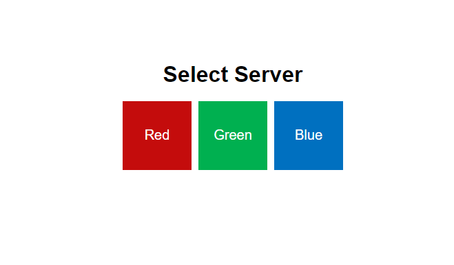
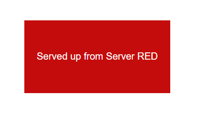
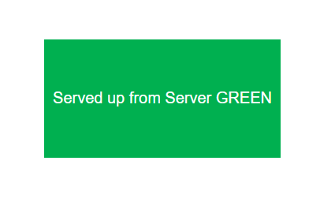
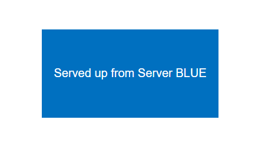

# RGB HTML Server

It is an HTML file that displays a rectangle in Red, Green, or Blue. This can be useful for load balancing labs, such as those involving F5 LTM. Simply place this `index.html` file on your web server and set the `server` variable in the `<script>` to either 'red', 'green', or 'blue'. If the `server` variable does not match any of these colors, the default selector page will be displayed.

## Screenshots

